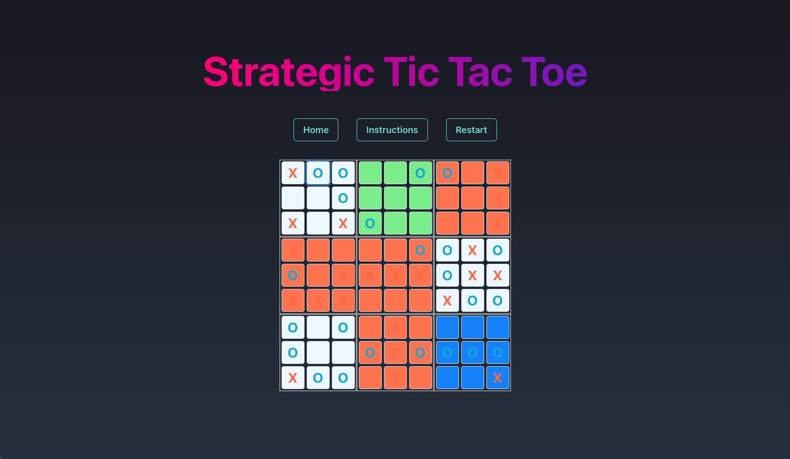

# Strategic Tic Tac Toe



This project, made for my Senior Capstone Course, is an implementation of the classic game of Tic Tac Toe built, but with an additional strategic twist. In this version, you are not limited to playing in a single 3x3 grid, but rather a nine of them, arranged in a 3x3 format.

## Basics of the Game

The objective of Stategic Tic Tac Toe is the exact same as the traditional game -- to get three of your symbol in a row, whether that be horizontally, vertically, or diagonally. However, in this version, the game is played on a larger grid which consists of nine individual tic tac toe boards.

During their turn, players place their symbol (either X or O) into empty spaces on one of the boards. The catch of this game is the fact that the opponent's decision determines the position of your move. For example, if your opponent places their symbol in the top-right corner of any small board, you must play your subsequent move in the top-right board of the large grid.

You can win an individual small tic tac toe board just like traditional Tic Tac Toe, and the goal is to win the larger 9x9 grid by winning three small boards in a row.

## Additional Game Modes

### Crazy Mode

In Crazy Mode, a significant modification is introduced to the standard gameplay: players receive the capability to shuffle the entire 9x9 board, but this ability is restricted to a single use per player. Upon activation of the 'shuffle' function, the nine constituent 3x3 boards undergo a randomized rearrangement. Consider a scenario where a player is on the verge of completing a win on a smaller board. Utilizing the shuffle can shift that board's location, thereby modifying the expected sequence of gameplay.

This random reconfiguration introduces a non-linear aspect to the gameplay. Players, who might traditionally employ deterministic strategies spanning multiple moves, are now presented with an element of stochasticity. The introduction of this unpredictable element necessitates an adaptable approach, requiring players to dynamically adjust their strategies. Consequently, the emphasis is not solely on the direct competition with the opponent based on a known board configuration but also involves navigating the challenges presented by potential board rearrangements. The objective remains consistent: achieving a win, but the path to victory becomes less predictable.

### Battle Squares Mode

Battle Squares Mode introduces an additional strategic component to the game's landscape. As players traverse the 9x9 board, a distinct square, identifiable by its light purple hue, becomes evident. This square, termed the "battle square," serves a purpose beyond mere visual distinction. Securing this square confers upon the player a one-time 'shuffle' capability, similar to that in Crazy Mode, allowing them to randomly rearrange the primary 9 squares.

This conferred ability offers both an opportunity and a challenge. The immediate question for players becomes whether to allocate resources and strategic focus towards claiming this square, given its potential game-altering ability. However, this focus must be balanced against the overarching objective of the game, which remains to secure wins on the smaller boards leading to an eventual victory on the larger board.

The inclusion of the battle square introduces an optimization challenge: the player must decide between an immediate, potentially disruptive advantage and longer-term strategic objectives. It presents a dichotomy between securing a tactical advantage that could change the immediate state of play and maintaining a broader strategic focus on the overall game progression.

## Setup

To get started with this project, follow the steps below:

1. Clone the repository:

   ```
   git clone https://github.com/JetJadeja/strategic-tic-tac-toe.git
   ```

2. Make sure you have Yarn installed on your machine. If not, you can install it by following the instructions at [Yarn Installation](https://classic.yarnpkg.com/en/docs/install).

3. Navigate to the cloned repository's directory:

   ```
   cd strategic-tic-tac-toe
   ```

4. Use Yarn to install the project dependencies:
   ```
   yarn
   ```

Congratulations! The project is now set up and ready to go.

## Running the Program

To run the Strategic Tic Tac Toe game, execute the following command:

```
yarn start
```

This command will start the game and display it at localhost:3000

## Credits

My code was inspired by [`ultimate-tic-tac-toe`](https://github.com/Minimuino/ultimate-tic-tac-toe-react/tree/master) by Minimuino. The style of the board was pretty much taken from their index.css file!
